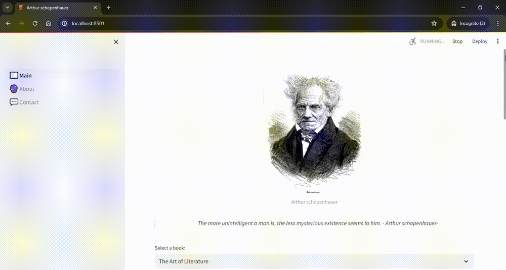

# Schopenhauer: Visualizing Texts of Wisdom 📚


=======

## Prerequisites

Before running the project, ensure you have the following installed:
- [Python 3.x](https://www.python.org/downloads/)
- [pip](https://pip.pypa.io/en/stable/)
- Git

## Installation

Follow these steps to set up and run the app on your local machine:

1. Clone the repository:
```bash
git clone https://github.com/AbdeChk/Schopenhauer-Visualizing-Texts-of-Wisdom.git
```

2. Navigate to the project directory:
```bash
cd Schopenhauer-Visualizing-Texts-of-Wisdom
```

3. Create and activate a virtual environment (recommended):
```bash
# On Windows
python -m venv venv
.\venv\Scripts\activate

# On macOS/Linux
python3 -m venv venv
source venv/bin/activate
```

4. Install required dependencies:
```bash
pip install -r requirements.txt
```

5. Run the application:
```bash
streamlit run app.py
```

The application will open in your default web browser at `http://localhost:8501`.
